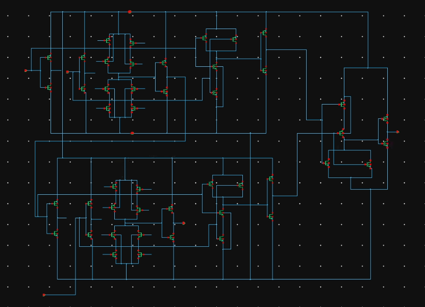
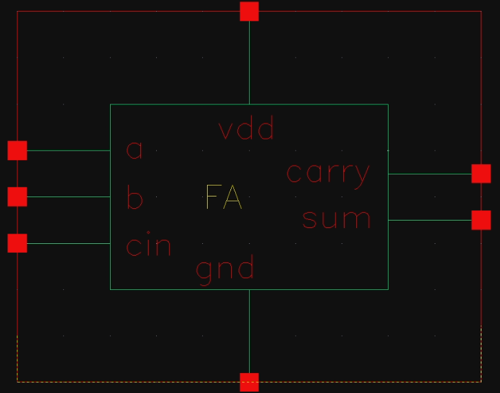
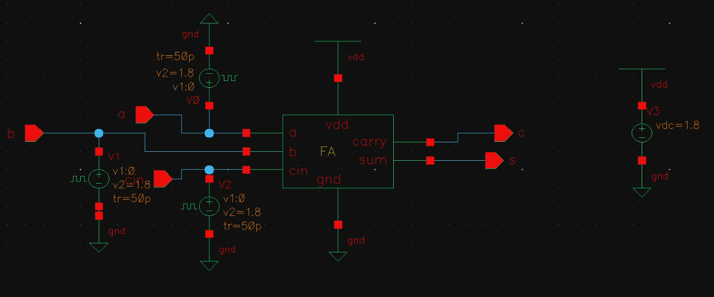
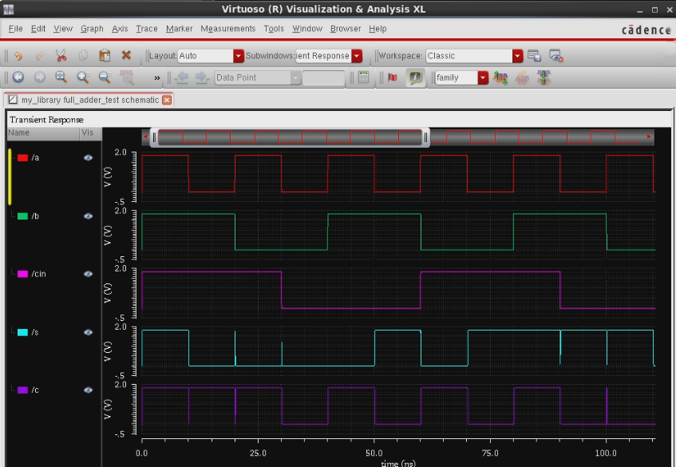
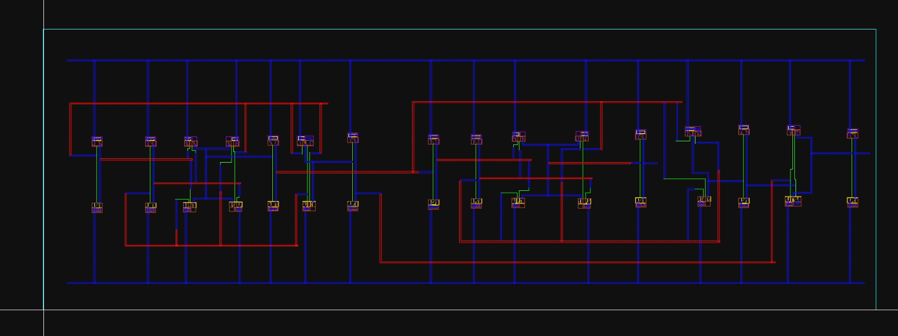
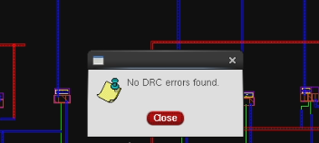
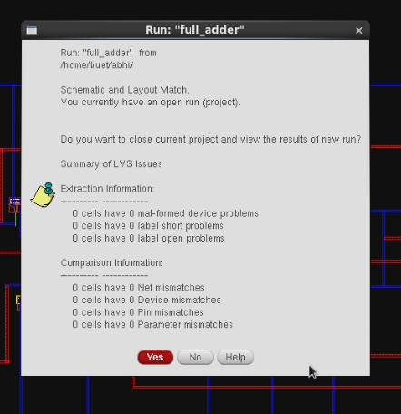
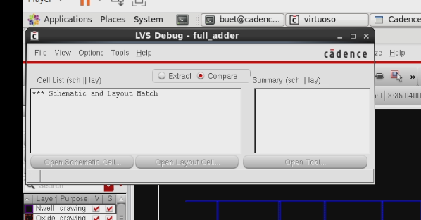
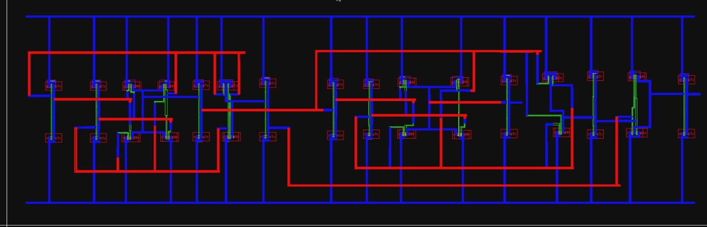

# full-adder-cadence-project
CMOS Full Adder design using Cadence Virtuoso including schematic design, simulation and layout verification (DRC, LVS REX).
# CMOS Full Adder Design using Cadence Virtuoso

## Project Overview

This repository demonstrates the complete design and verification of a CMOS Full Adder using Cadence Virtuoso. A Full Adder is a fundamental combinational logic circuit that performs the addition of three binary inputs (A, B, and Cin) and produces two outputs: Sum (S) and Carry-out (Cout).

The project follows a full-custom VLSI design flow including schematic implementation, symbol creation, testbench simulation, layout design, physical verification (DRC & LVS), and RC parasitic extraction.

---

# Design Specifications

Technology : CMOS
Design Tool : Cadence Virtuoso
Simulator : Spectre
Verification : DRC, LVS
Extraction : RC Parasitic Extraction
Design Style : Full Custom IC Design

---

# Theory

A Full Adder is a fundamental combinational logic circuit used in digital systems to perform the addition of three binary inputs. These inputs typically include two significant bits (A and B) and a carry input (Cin) from the previous stage of addition.

## Full Adder

A Full Adder adds three single-bit inputs:

* A (First operand)
* B (Second operand)
* Cin (Carry input)

It produces two outputs:

* **Sum (S)**
* **Carry-out (Cout)**

---

## Boolean Expressions

Sum Output

S = A ⊕ B ⊕ Cin

Carry Output

Cout = AB + BCin + ACin

---

## Truth Table

| A | B | Cin | Sum | Cout |
| - | - | --- | --- | ---- |
| 0 | 0 | 0   | 0   | 0    |
| 0 | 0 | 1   | 1   | 0    |
| 0 | 1 | 0   | 1   | 0    |
| 0 | 1 | 1   | 0   | 1    |
| 1 | 0 | 0   | 1   | 0    |
| 1 | 0 | 1   | 0   | 1    |
| 1 | 1 | 0   | 0   | 1    |
| 1 | 1 | 1   | 1   | 1    |

The Sum output is generated using XOR logic while the Carry output is generated using AND-OR logic.

---

## CMOS Implementation

The Full Adder circuit is implemented using CMOS logic gates constructed with complementary PMOS and NMOS transistor networks.

The design typically includes:

* XOR gates for Sum calculation
* AND gates for carry generation
* OR logic for combining carry signals

---

# VLSI Design Flow

1. Logic design and Boolean verification
2. Transistor-level schematic implementation
3. Symbol generation for hierarchical design
4. Testbench creation for functional verification
5. Transient simulation and waveform analysis
6. Layout implementation following CMOS layout rules
7. Design Rule Check (DRC) verification
8. Layout Versus Schematic (LVS) verification
9. RC parasitic extraction

---

# Schematic Design

The transistor-level schematic of the Full Adder was implemented in Cadence Virtuoso according to the Boolean expressions for Sum and Carry outputs.

---

# Symbol Creation

A symbol view was generated so that the Full Adder can be easily reused in hierarchical designs such as ripple carry adders.

---

# Testbench Setup

A testbench circuit was created to apply different input combinations (A, B, Cin) and verify correct circuit functionality.

---

# Simulation Waveform

Transient simulation confirms correct behavior of the Sum and Carry outputs according to the Full Adder truth table.

---

# Layout Design

The physical layout was implemented following standard CMOS layout design rules including transistor placement, metal routing, and well contacts.

---

# Design Rule Check (DRC)

DRC ensures that the layout satisfies all technology fabrication constraints.

---

# Layout Versus Schematic (LVS)

LVS verifies that the layout connectivity matches the schematic netlist.

---

# LVS Match Result

The LVS match result confirms that the schematic and layout are electrically identical.

---

# RC Parasitic Extraction

RC extraction identifies parasitic resistance and capacitance introduced by layout interconnects for accurate post-layout analysis.

---

# Results

Correct Full Adder functionality verified
DRC passed successfully
LVS matched successfully
RC parasitic extraction completed

---

# Tools Used

Cadence Virtuoso

---

# Author

Abhijit Wankhede
